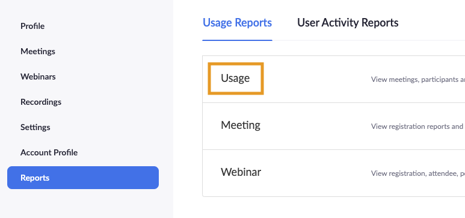
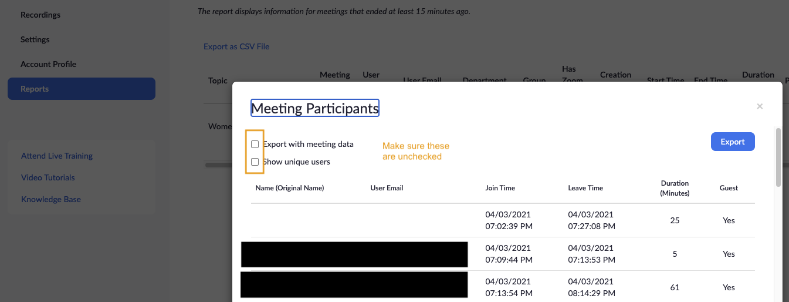
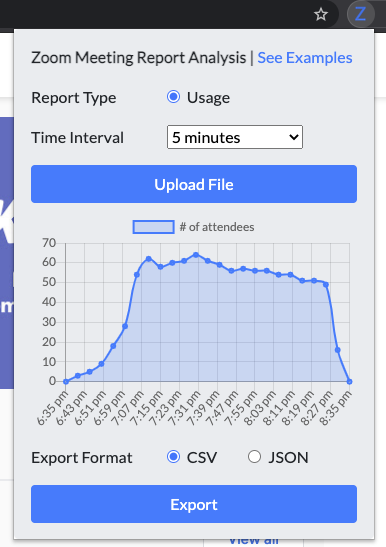

---
### :eyes: what this is
* A simple chrome extension that parses through your Zoom meeting usage report and return with formatted data & chart that shows you the user count at given time of the meeting. 

### :flushed: why I made it

* I run a weekly [Chinese Women in Tech event series](https://www.youtube.com/channel/UCUx6aQyNdef53p1prVerXzA/about) over Zoom where we invite speakers for feature presentation or panel discussions to showcase their projects, experiences, and thought leadership working in the tech industry. 
* I look at the meeting usage report each week to track attendance count but the exercise of copying/pasting Zoom report, update formulas, and refreshing an Excel every week just became too tedious after a few weeks. 
* Zoom's [App Marketplace](https://marketplace.zoom.us/) has a lot of fancy dashboards and analytic tools for enterprise admins to look at overall meeting usage & activities for large organizations, but nothing that's light enough for an everyday individual user's needs (aka me). 

### :rocket: how to use it

* Download the extension at the Chrome Web Store ([here](https://chrome.google.com/webstore/detail/zoom-meeting-report-analy/bpepajnpjedkmjjfnifgnbenmeiejmlj?hl=en&authuser=0))
* Go to your Zoom account → Reports → Usage Reports → Usage
  
  

* Find your meeting and download the usage reports

  

* Upload your report and see the charts rendered! Example below: 
  
  

* You can choose to see use count at different time intervals, and export the parsed data in CSV or JSON format to use in any data analysis tool you prefer (Excel, Google Sheets, etc.)

### :bookmark: disclaimer
Not affiliated with Zoom. For any questions, issues, comments, requests, feel free to submit an issue here.
